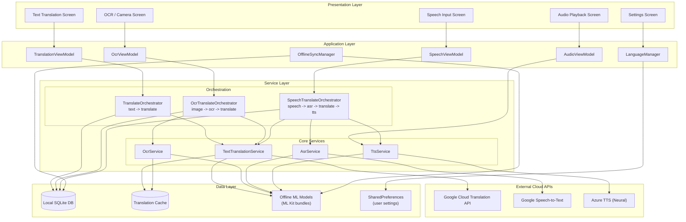
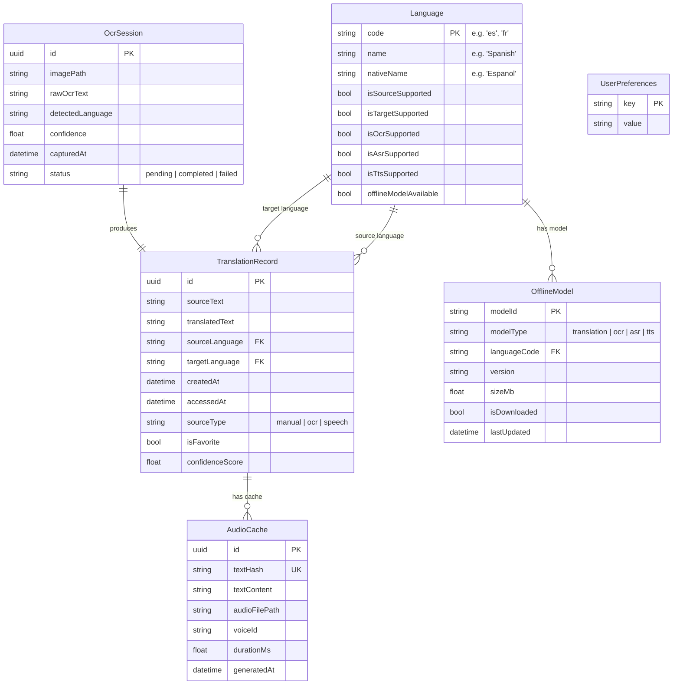
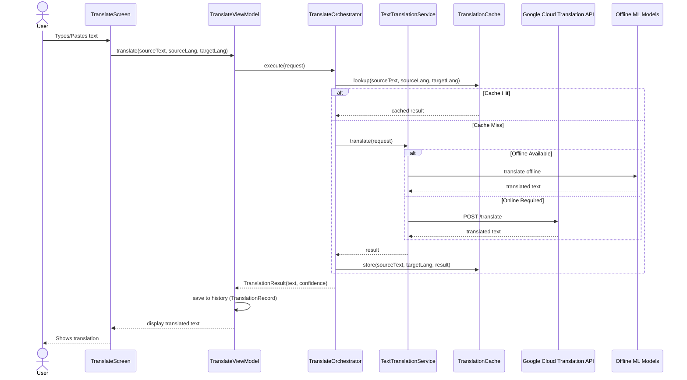
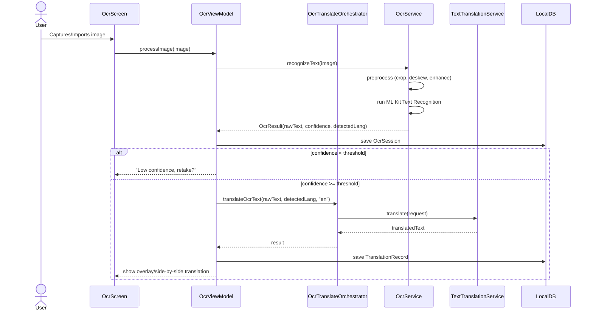
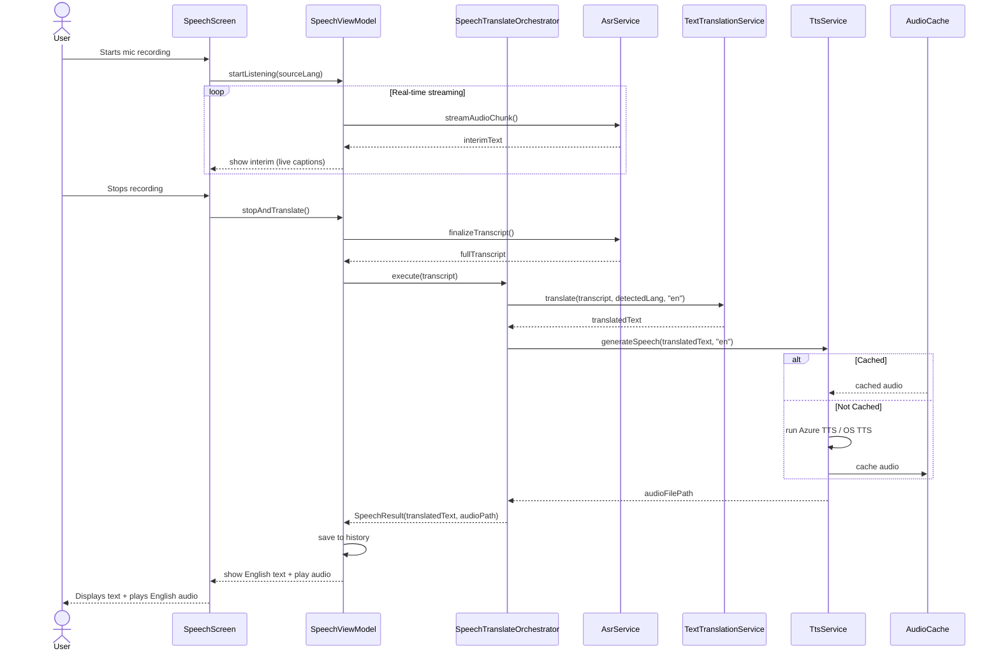
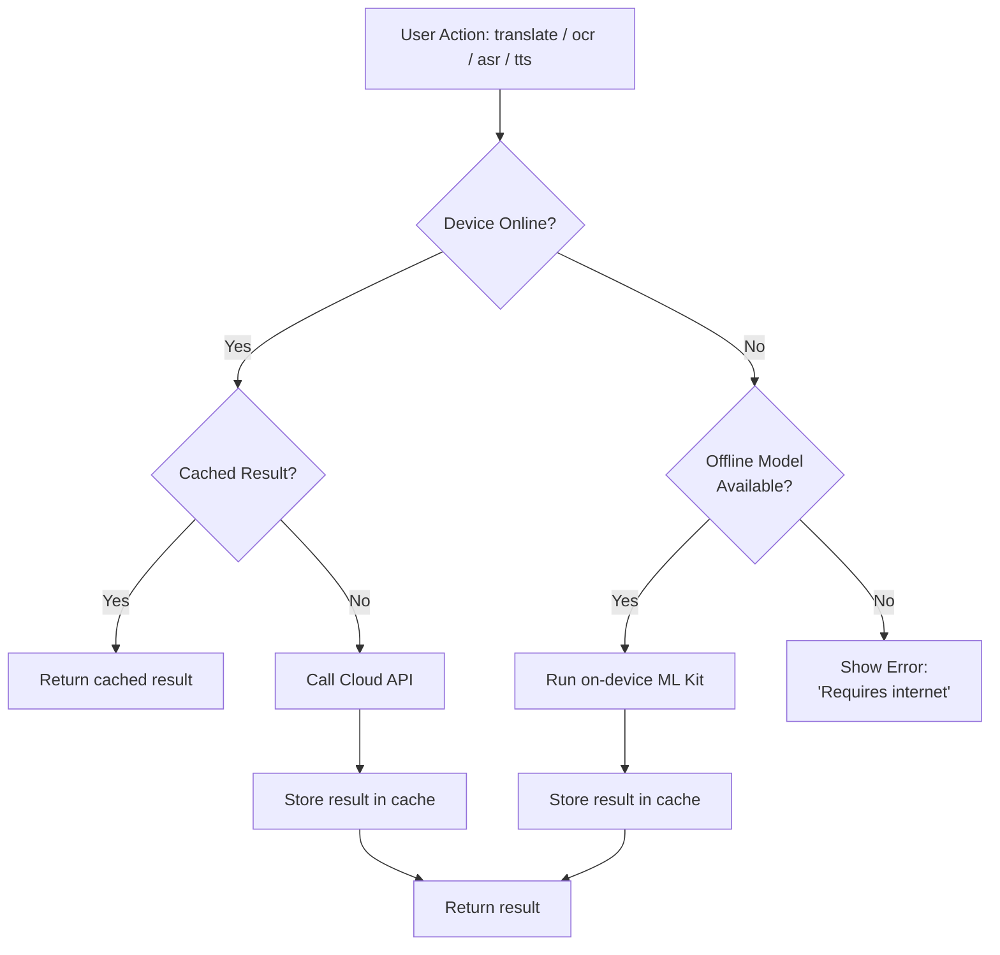
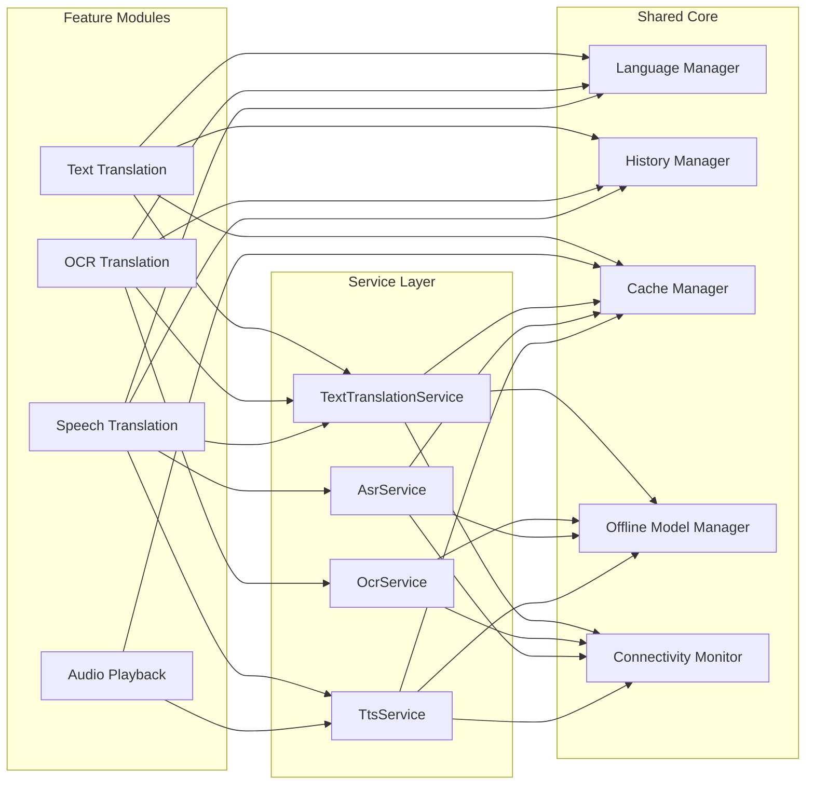

# Translator Mobile App — Architecture

## Chosen Stack — Balanced (Choice B)

| Layer | Technology | Rationale |
|---|---|---|
| **Framework** | Flutter | Cross-platform, single codebase, mature ML Kit plugins |
| **Text Translation (cloud)** | Google Cloud Translation API | Best accuracy for 10+ languages, largest language coverage |
| **Text Translation (offline)** | Google ML Kit (on-device) | Free, low latency, covers top 10 language pairs offline |
| **OCR** | Google ML Kit Text Recognition (on-device) | Free, fast, supports 60+ scripts, no cloud dependency |
| **ASR (cloud)** | Google Speech-to-Text | Best accuracy across 125+ languages, real-time streaming |
| **ASR (offline)** | Google ML Kit Speech (on-device) | Free fallback for top 5 languages |
| **TTS (cloud)** | Azure TTS (Neural) | Most natural English voices, fine-grained SSML control |
| **TTS (offline)** | OS-level TTS (AVSpeech / Android TTS) | Free, on-device fallback when offline |
| **Local storage** | SQLite | Reliable, zero-config, well-supported in Flutter |
| **Cache** | In-memory LRU cache | Minimizes repeat cloud calls, improves latency |
| **Settings** | SharedPreferences | Simple key-value persistence for user prefs |

**Fallback hierarchy**: Cache → Offline ML Kit → Cloud API (see §4 for decision tree).

---

## 1. System Architecture

---

## 2. Entity Architecture (Data Model)

---

## 3. Sequence Diagrams — Core Flows

### 3a. Text Translation Flow

### 3b. OCR + Translation Flow

### 3c. Speech -> English Audio Flow

---

## 4. Offline vs Online Decision Tree

---

## 5. Component Dependency Map

---

## 6. Scope Notes

| Feature | Languages | Offline | Excluded (v1) |
|---|---|---|---|
| Text Translation | 10+ | Top 10 pairs | Emoji, mixed-language, special chars, URLs |
| OCR + Translation | 10+ (OCR) | — | Blurry, skewed, handwritten, low light, multi-language images |
| Foreign Text -> English Audio | TTS: English only | — | Long text chunking, abbreviations/numerals |
| Speech -> English Audio | ASR: 10+ source | — | Background noise, multiple speakers, overlapping, strong accents, code-switching |
